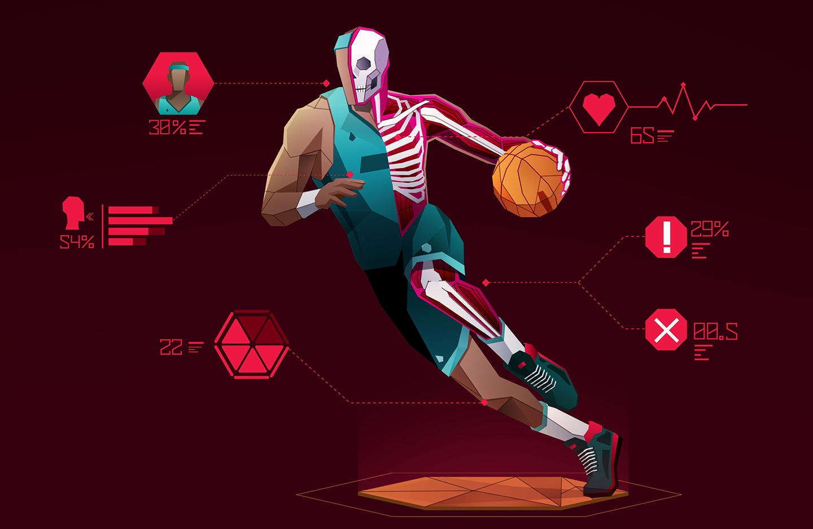

```{r setup, include=FALSE}
knitr::opts_chunk$set(echo = TRUE)
```
# **Introduction**
<br>
Le sport se perfectionne de plus en plus que ce soit par les entraînements, les tactiques, les effectifs, le suivi médical, mental et également au niveau de la performance grâce à la data. Des années 80 à aujourd’hui le temps de jeu effectif s’est vu triplé, ce qui augmente le nombre de données et d’actions décisives au cours d’un match.

<br>

La data est présente depuis des décennies, son utilisation a pris un certain temps avant d’être acceptée par les coachs et les joueurs. Son utilisation s’en est vue accrue depuis l’émergence des objets connectés et d’algorithmes complexes.

<br>

# **Les formes de data dans le sport**
<br>
La data dans le sport est représentée sous quatre formes :

<br>

Les données GPS permettent de récolter les informations durant les entraînements et les matchs concernant la vitesse, la distance parcourue, le nombre d’accélérations et leur intensité. À cela, on ajoute des données spécifiques à chaque sport tel au rugby où l’on récolte le nombre de chocs et leur puissance, étant une variable très importante dans la pratique de ce sport.

<br>

Une évaluation au cardiofréquencemètre afin de connaître la puissance maximale possiblement dégagée par le joueur, la force maximale, la capacité à répéter des efforts et de l’intensité. Ces données seront utilisées afin d’adapter les entraînements au mieux pour par exemple palier à ses faiblesses. Cela permet aussi d’avoir une idée globale de l’état de forme « classique » du joueur et de suivre son état de santé au cours de la saison. Ce type d’évaluation est généralement réalisé au moins une fois en amont de la saison.

<br>

La vidéo, cette data est strictement réservées à l’utilisation tactique. On y retrouve le nombre de passe, le nombre d’accélération, la formation, la communication entre les joueurs. Dans un premier temps utilisé pour visionner les erreurs faites lors de matchs ou de rencontres amicales la technologie permet aujourd’hui de reconnaître directement les données à extraire. Les algorithmes développés durant la dernière décennie permettent désormais d’économiser un temps considérable. Ces données, auparavant récoltées à la main sont désormais directement reconnues et n’ont plus qu’à être analysées. Cette avancée donne une nouvelle dimension au scouting, pour, dans de rares cas, aider à dénicher de nouveaux talents et principalement pour la recherche de faille dans le jeu adverse. Le tout permet notamment d’identifier des patern dans le jeu adverse, de trouver des contre-stratégies afin de s’adapter au mieux et d'appuyer sur les faiblesses de l’adversaire.

<br>

Enfin, le « Rating of Perceived Exertion » que l’on simplifiera par Ressenti Post-Entraînement en français permet d’obtenir une mesure quantitative sur la perception de l’effort durant l’exercice physique. Cet indice de perception de l’effort peut être comparé avec les données antérieures du compétiteur et ainsi connaître son état de forme. Les données du RPE peuvent être croisées avec d’autres facteurs, une corrélation modérée de 0,7 a été trouvée pour le cœur et le RPE.

@fondation_jean_jaures_comment_2023
@cauvin_evaluations_2021

<br>

# **L'utilisation actuelle dans le sport, en Europe**

<br>

Le choix en matière de data n’a jamais été aussi grand et pourtant, il n’est pas rare de voir de mauvaises applications. La data n’est ni bonne ni mauvaise, elle est ce qu’on en fait.

<br>

La variété d’options disponible rend parfois difficile de savoir quelle donnée choisir et comment l’exprimer, à chaque interlocuteur le bon dialogue et par conséquent les bonnes données et manières de les présenter. Il est important de ne pas tomber dans les mauvais usages, de regarder grâce à la vidéo uniquement les bonnes actions, de faire certaines actions uniquement pour les statistiques, etc… La data doit être une information utile et non plaisante. Il est important de ne pas déshumaniser les joueurs au point de les réduire à de simples statistiques.

<br>

Dans le même ordre d’idées, il faut faire la différence entre corrélation et causalité. Un exemple frappant dans le rugby, pendant quelque temps, on a constaté que les équipes victorieuses avaient un pourcentage de balle au pied plus élevé que l’équipe adverse. Cela n’a en réalité aucun impact sur l’issue du match, cependant, cela a amené une équipe anglaise a majoritairement utiliser cet aspect du jeu pendant toute une première mi-temps. Menée avant la mi-temps de plus d’une trentaine de points, l’équipe est ensuite revenue au score atteignant le 38 à 38. Ce n’est pas la statistique qui est intelligente ou non, simplement son utilisation. Il est important d’adapter la stratégie grâce aux données individuelles des joueurs comme pour la précision ou l’endurance.

<br>

Dans d’autres cas, on peut utiliser les données sur un aspect médical. Au rugby, les commotions ont dans un premier temps été très élevées, lorsque que relevé dans les data, puis ont peu à peu diminuée avant de se stabiliser. On peut donc en conclure que leur approche et prévention s’est vu accroître. Grâce à la technologie, on peut désormais pointer du doigt des problèmes, parfois connu par tous, afin de garder un œil sur leur évolution et de voir l’efficacité des solutions proposées.

<br>

La data représente une opportunité de limiter les risques de blessures, de les prévenir. On peut, en temps réel, suivre la forme du joueur en se basant sur les données habituelles et la performance durant le match. Il est possible de configurer des alertes afin d’être automatiquement notifier si un joueur « dépasse ses capacités ». Le but est d’anticiper une surcharge d’efforts, pour se faire il fait instaurer un seuil à partir duquel le joueur entre dans sa zone de risque.

@tedx_talks_data_2024
@noauthor_ropredominant_nodate

<br>

# **Perspectives d'avenir**
<br>
Juridiquement, les données sont un point sensible, allant de la donnée personnelle à la performance et au médical. Certes, le RGPD existe, mais ce n’est pas tout. Il est clair que certains clubs vont s’échanger des données sur différents joueurs. L’éthique sur l’utilisation des données et leur conservation pose question.

<br>

À l’avenir, il n’est pas impossible de voir la data impacter le mercato, que certains clubs rompent des contrats basés uniquement sur des data. Il est possible de voir des clubs profiter des data avant les transferts afin de « vérifier » la fiabilité des joueurs, d’effectuer des rankings et ainsi impacter le mercato. Un risque long terme existe quant au focus trop accentué sur la data. On risque de voir des joueurs moins instinctifs et plus concentré sur la meilleure action proposée par la machine plutôt que celle qui leur convient le mieux comme on le voit actuellement avec les échecs.

<br>

Le joueur doit aussi apprendre à certes regarder les bonnes actions sur le replay et en même temps à ne pas perdre de vue les actions pas ou mal réalisées. Il est nécessaire de combiner la data et l’intelligence humaine pour en comprendre tous les aspects, l’intuition est un facteur nécessaire.

@noauthor_comment_2022
@sport_unlimitech_data_2022
@datarockstars_rodata_2023
@deporte_big_2023

<br>

```{r image, echo=FALSE, out.width = '60%', fig.align = "center"}

```

<br>

# **Conclusion**

<br>

La data est présente en tout point, pour l’expérience des spectateurs dans le stade ou regardant la diffusion afin de suivre les performances de leur équipe ou joueur favori. Cela va aussi de paire avec la communication sur les réseaux sociaux où des données comme la possession de balle, le nombre de but inscrits ou encore le temps de jeux y sont utilisés. Les coachs viennent l’implémenter à la préparation des joueurs avec l’aide des analystes. Les investisseurs l’utilisent afin de définir le rayonnement des événements. Les joueurs eux, sont la source de la majorité des données et probablement ceux qui les regardent le moins et devraient recevoir une aide voire une formation afin de comprendre comment utiliser ces informations. Il me semble nécessaire de sensibiliser chacun des acteurs du sport à l’utilisation des données, leur compréhension, limites et risques.

<br>

L’enjeux de demain est de parvenir à faire collaborer différents acteurs, les analystes, entraineurs, médecins et d’autres professions, cela à travers différents sports afin de croiser les analyses et les solutions que l’on peut tirer via les données. L’utilisation des nouvelles technologies, notamment de l’IA, pourraient redéfinir les méthodes de collecte et d’analyses de données.

<br>

# **Bibliographie**